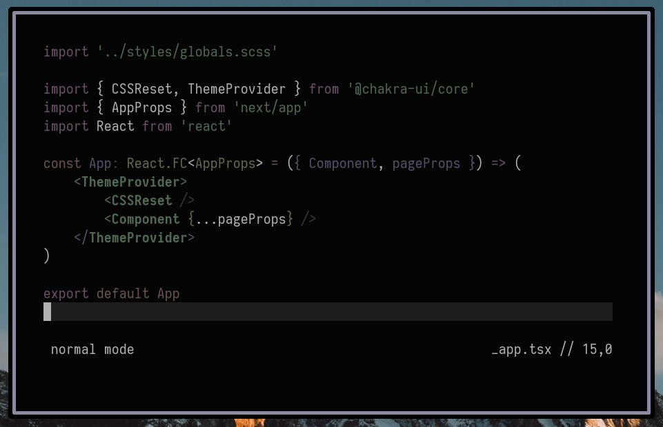

# terra.vim

A muted color scheme for (Neo)vim.

<p align="center">
	
</p>

### [Vim packages][]

```sh
git clone https://github.com/safinsingh/terra.vim ~/.vim/pack/plugins/start/terra.vim
```

### [vim-plug][]

1. Add the following configuration to your `.vimrc` or `init.vim`.

   `Plug 'safinsingh/terra.vim'`

2. Install with `:PlugInstall`

### [Vundle][]

1. Add the following configuration to your `.vimrc` or `init.vim`.

   `Plugin 'safinsingh/terra.vim'`

2. Install with `:PluginInstall`

### [NeoBundle][]

1. Add the following configuration to your `.vimrc` or `init.vim`.

   `NeoBundle 'safinsingh/terra.vim'`

2. Install with `:NeoBundleInstall`

### [dein.vim][]

1. Add the following configuration to your `.vimrc` or `init.vim`.

   `call dein#add('safinsingh/terra.vim')`

2. Install with `:call dein#install()`

[vim packages]: https://vimhelp.org/repeat.txt.html#packages
[vim-plug]: https://github.com/junegunn/vim-plug
[vundle]: https://github.com/VundleVim/Vundle.vim
[neobundle]: https://github.com/Shougo/neobundle.vim
[dein.vim]: https://github.com/Shougo/dein.vim
